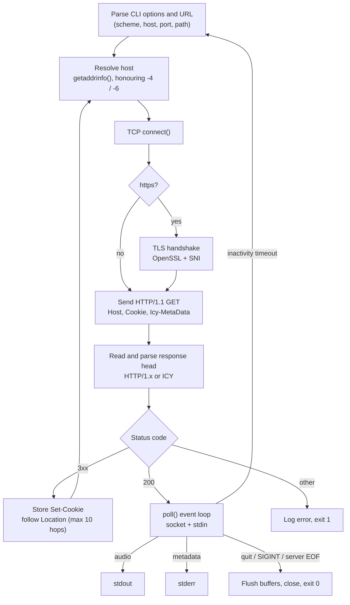

# 📻 Internet Radio Client — `sikradio`


A command-line **internet radio client written from scratch in C++20** on top of raw **POSIX sockets**.
It connects to SHOUTcast / Icecast streaming servers over **HTTP or HTTPS**, follows redirects (with cookies),
separates **in-band ICY metadata** (the "now playing" song titles) from the audio stream, and pipes clean audio
to any player that reads from `stdin`.

No HTTP or networking libraries are used: DNS resolution, the TCP connection, the HTTP/ICY protocol, redirect
handling, cookie handling and the metadata demultiplexer are all implemented by hand. OpenSSL is used only for the TLS layer.

> 🎓 **University project, Computer Networks course.** The assignment specified only the command-line interface and the
> required behaviour, and included a few recorded sessions with real radio stations. **Working out the protocol details
> from those sessions was part of the task.** The only allowed tools were the socket API and OpenSSL (`libssl` / `libcrypto`),
> code quality was graded, and automated tests rigorously checked the received audio stream and metadata: playback had
> to be free of stutter and distortion.

```bash
./sikradio -u https://stream.nowyswiat.online/mp3 -m | play -q -t mp3 -
```

---

## ✨ Features

- **Unmodified audio passthrough**: the client never decodes or re-encodes audio. Received bytes go to `stdout` unchanged (only the metadata blocks are removed), and a separate player handles playback
- **HTTP and HTTPS streams**: plain TCP or TLS (OpenSSL, with SNI), selected automatically from the URL scheme
- **Redirect following**: up to 10 hops (`3xx` + `Location`), across hosts, ports and even `http` ↔ `https`
- **Cookie support**: `Set-Cookie` headers from redirect responses are stored (with `Domain` matching) and sent back on the next request, which some CDNs require
- **ICY metadata demultiplexing** (`-m`): requests `Icy-MetaData: 1`, then strips metadata blocks out of the audio and prints song titles
- **Both server dialects**: accepts SHOUTcast `ICY 200 OK` responses and standard `HTTP/1.0` / `HTTP/1.1`, and tolerates `\r\n` as well as bare `\n` line endings
- **IPv4 / IPv6**: automatic selection, forced with `-4` / `-6`, and IPv6 literals in URLs (`http://[2001:db8::1]:8000/stream`)
- **Single-threaded event loop**: `poll()` watches the network socket and `stdin` at the same time
- **Inactivity timeout with auto-reconnect**: if no data arrives for `-t` ms, the client reconnects on its own
- **Graceful shutdown**: on `quit`, `Ctrl+C` (`SIGINT`) or server EOF, buffered audio and partial metadata are flushed before the connection closes
- **5 verbosity levels**, from silent to full protocol traces
- **Flexible CLI**: options in any order, attached values (`-t3500`), grouped flags (`-m46`); a repeated option takes its last value

---

## 🎬 Demo

One of the reference sessions from the assignment, shortened (`-6` forces IPv6, `-m` enables metadata). `sikradio` prints its
diagnostics in the same format. The client gets a `302` with a cookie, follows the redirect to a CDN node, sends the cookie back,
and starts printing track titles while the audio goes to the player:

```text
$ ./sikradio -u http://stream.rcs.revma.com/ypqt40u0x1zuv -6m | play -q -t mp3 -
2025.11.09 18.17.48
resolving name stream.rcs.revma.com
connecting to server [2001:41d0:203:8b98::]:80
GET /ypqt40u0x1zuv HTTP/1.1
Host: stream.rcs.revma.com
Connection: Keep-Alive
Icy-MetaData: 1

HTTP/1.0 302 Found
Location: http://n44a-eu.rcs.revma.com/ypqt40u0x1zuv?rj-ttl=5&rj-tok=AAABmmmo6d4Aye2aM7Z8HR9voA
Set-Cookie: rj-listener-cookie=1qbs1mbwajfp5; Domain=revma.com

resolving name n44a-eu.rcs.revma.com
connecting to server [2001:41d0:203:d358::]:80
GET /ypqt40u0x1zuv?rj-ttl=5&rj-tok=AAABmmmo6d4Aye2aM7Z8HR9voA HTTP/1.1
Host: n44a-eu.rcs.revma.com
Connection: Keep-Alive
Cookie: rj-listener-cookie=1qbs1mbwajfp5
Icy-MetaData: 1

HTTP/1.1 200 OK
content-type: audio/mpeg
icy-name: Radio Nowy Swiat
icy-metaint: 16000

StreamTitle='Kosma Król & Kuba Więcek - syf na sell';
StreamTitle='Radio Nowy Świat - Pion i poziom!';
StreamTitle='Demae - Don't Play The Fool';
```

All reference sessions are in [`sikradio_examples/`](sikradio_examples/).

---

## 🚀 Getting started

### Requirements

| What | Why |
|---|---|
| Linux (or another POSIX system) | BSD sockets, `poll()`, `sigaction()` |
| A C++20 compiler (GCC ≥ 10 / Clang ≥ 10) | `std::string_view::starts_with`, structured bindings, etc. |
| `make`, `pkg-config` | Build |
| OpenSSL development headers (`libssl-dev`) | HTTPS / TLS |
| An audio player that reads from stdin | Playback (e.g. SoX `play`, `mpv`, `ffplay`) |

On Debian / Ubuntu:

```bash
sudo apt install build-essential pkg-config libssl-dev sox libsox-fmt-mp3
```

### Build

```bash
git clone https://github.com/igorstec/internet-radio-client.git
cd internet-radio-client
make            # produces ./sikradio
make clean      # removes object files and the binary
```

### Run

The client writes **raw audio to `stdout`**, so pipe it into a player:

```bash
# SoX
./sikradio -u http://stream.radiobaobab.pl:8000/radiobaobab.mp3 -m | play -q -t mp3 -

# mpv
./sikradio -u https://stream.nowyswiat.online/mp3 -m | mpv --really-quiet -

# ffplay
./sikradio -u http://stream3.polskieradio.pl:8900 | ffplay -nodisp -autoexit -
```

While it is playing, type `quit` + Enter (or press `Ctrl+C`) to stop.

---

## 🧰 Usage

```text
./sikradio -u url [-m] [-t timeout] [-4] [-6] [-v verbosity] [-q]
```

| Option | Description | Default |
|---|---|---|
| `-u url` | **Required.** Stream URL: `http://…`, `https://…`, or a bare `host[:port][/path]` (treated as HTTP). IPv6 literals go in brackets: `http://[::1]:8000/live` | — |
| `-m` | Request and demultiplex ICY metadata (`Icy-MetaData: 1`) | off |
| `-t ms` | Inactivity timeout in milliseconds, range `100`–`100000`. When it expires, the client reconnects | `5000` |
| `-4` | Resolve and connect over IPv4 only | off |
| `-6` | Resolve and connect over IPv6 only | off |
| `-v n` | Verbosity level `0`–`4` (see below) | `2` |
| `-q` | Quiet mode, same as `-v0` | — |

With both `-4` and `-6`, or neither, the IP version of the first address returned by `getaddrinfo()` is used.
Options can appear in any order, values can be attached (`-t3500`, `-v4`), flags can be grouped (`-m46`, `-mq`),
and a repeated option takes its last value.

### Handy recipes

```bash
# Record a stream to a file instead of playing it
./sikradio -u http://stream.radiobaobab.pl:8000/radiobaobab.mp3 -q > recording.mp3

# "Now playing" ticker: song titles only, audio discarded
./sikradio -u https://stream.nowyswiat.online/mp3 -mq > /dev/null

# Keep the protocol log in a file while listening
./sikradio -u https://stream.nowyswiat.online/mp3 -m -v4 2> session.log | play -q -t mp3 -
```

### Input and output streams

| Stream | Content |
|---|---|
| `stdout` | Raw audio bytes (e.g. MP3). With `-m`, the metadata blocks have already been removed |
| `stderr` | Metadata lines (`StreamTitle='…';`, always printed) plus diagnostic logs (controlled by `-v`) |
| `stdin` | Commands: a line containing `quit` ends the program |

### Verbosity levels

Levels are cumulative: each one includes everything from the levels below it.

| Level | What gets logged to `stderr` |
|---|---|
| `0` (`-q`) | Nothing except stream metadata |
| `1` | Connection trace: timestamp, resolved name, `IP:port`, full request and response headers, timeouts |
| `2` *(default)* | + critical errors |
| `3` | + non-critical warnings (e.g. server ignored the metadata request, malformed `Set-Cookie`) |
| `4` | + debug: parsed configuration, TLS handshake, stored cookies, redirects, `icy-metaint`, session lifecycle |

Invalid command-line arguments are always reported, whatever the verbosity. Exit code: `0` on a normal stop, `1` on invalid arguments or a critical error.

> ℹ️ Error and debug messages are in Polish, the language the course was taught in.

---

## ⚙️ How it works

### Connection lifecycle



1. **URL parsing**: the scheme picks the transport and default port (`http` → 80, `https` → 443). Host, explicit port, path and bracketed IPv6 literals are extracted.
2. **DNS resolution**: `getaddrinfo()` with `AF_INET`, `AF_INET6` or `AF_UNSPEC`, depending on `-4` / `-6`.
3. **Connect**: a TCP socket is opened. For `https`, an OpenSSL session is layered on top of it, with SNI set so that virtual-hosted and CDN-fronted servers (e.g. Cloudflare) return the right certificate.
4. **Request**: a minimal `HTTP/1.1 GET` is built. The `Host` header is formatted correctly for IPv6 literals and non-default ports; matching cookies and `Icy-MetaData: 1` (with `-m`) are added.
5. **Response head**: bytes are read until the end of the headers (`\r\n\r\n` or `\n\n`, capped at 16 KiB). Any audio bytes that arrived in the same read are kept, not lost. Headers go into a case-insensitive multimap, so repeated headers such as `Set-Cookie` are preserved.
6. **Redirects**: on `3xx`, the `Location` header is resolved (absolute URL or path relative to the current host) and the whole process starts again on a **new connection**. Up to 10 hops are allowed.
7. **Streaming**: on `200`, the client reads `icy-metaint` (if present) and moves into the event loop.

### TCP vs UDP

All communication runs over **TCP** (`SOCK_STREAM` / `IPPROTO_TCP`). **UDP is not used.** HTTP, HTTPS and SHOUTcast/Icecast ICY are all TCP-based protocols. The client also depends on TCP's guarantees: ICY metadata positions are counted in exact byte offsets, so one lost or reordered byte would break the framing for the rest of the stream. A reliable, ordered byte stream is therefore a hard requirement, not just a convenient choice.

### HTTP vs HTTPS

Both go through a single `Transport` class that hides the difference:

| | HTTP | HTTPS |
|---|---|---|
| Default port | 80 | 443 |
| Layer | plain TCP socket | TCP socket + OpenSSL `SSL*` (`TLS_client_method`, SNI) |
| Read / write | `read()` / `write()` (retried on `EINTR`) | `SSL_read()` / `SSL_write()` |
| Close | `close(fd)` | `SSL_shutdown()` → free → `close(fd)` |

`Transport` is an **RAII, move-only** type that owns the file descriptor and the TLS objects, so resources are freed on every path, including exceptions. The rest of the code (request building, header parsing, demultiplexing) is identical for both schemes, which is also why a redirect chain can freely switch between `http` and `https`.

### ICY metadata (`-m`)

When the client sends `Icy-MetaData: 1` and the server supports it, the server responds with an `icy-metaint: N` header and interleaves metadata into the audio stream:

```text
┌──── N bytes ────┬───┬──── L × 16 bytes ────┬──── N bytes ────┬───┬──
│      audio      │ L │  metadata (padded)   │      audio      │ 0 │ …
└─────────────────┴───┴──────────────────────┴─────────────────┴───┴──
                    ↑ 1 length byte;  L = 0 means "no metadata this time"
```

The demultiplexer is a **byte-level state machine** (`audio → length byte → metadata → audio …`) kept in `StreamSession`. Because its state lives between reads, it works no matter how TCP splits the stream: a metadata block can start in one `read()` and end three reads later. Audio goes straight to `stdout`. Metadata is buffered, its trailing `\0` padding is stripped, and it is printed to `stderr` as a line. The buffer is walked with an index and compacted once per read, instead of erasing from the front after every chunk.

If `-m` is given but the server doesn't send `icy-metaint`, the client logs a warning and passes the stream through unchanged.

### Concurrency model: one thread, `poll()` multiplexing

The client is **single-threaded**. Handling the network and the user at the same time relies on **I/O multiplexing**, not threads: a single `poll()` call watches two descriptors:

- the **server socket** (`POLLIN | POLLERR | POLLHUP`): new audio or metadata, or a closed or broken connection
- **`stdin`** (`POLLIN`): user commands, split into lines (the buffer is capped at 4 KiB to protect against garbage input)

The `poll()` timeout is not fixed. It is recalculated on every iteration as *deadline − now*, where the deadline is *last received byte + `-t`*. That gives a precise inactivity timeout with no timers or extra threads. `SIGINT` is handled with `sigaction()` and a `volatile sig_atomic_t` flag. `poll()` returns `EINTR`, the loop sees the flag and shuts down cleanly.

> Note on naming: *multiplexing* here means two things. `-m` is the ICY **stream** multiplexing (audio + metadata in one byte stream); the event loop does **I/O** multiplexing (one thread, many descriptors).

### What blocks and what doesn't

The socket is left in **blocking mode**. The loop stays responsive because data is read **only after `poll()` reports it is ready**, so a read returns immediately with whatever has arrived.

| Operation | Behaviour |
|---|---|
| DNS resolution (`getaddrinfo`) | blocking |
| TCP `connect()` | blocking |
| TLS handshake (`SSL_connect`) | blocking |
| Sending the request (`write_all`) | blocking, loops until every byte is sent, `EINTR`-safe |
| Waiting for response headers | `poll()` on socket + `stdin` with a 200 ms tick, so `quit` works while waiting |
| Reading stream data | readiness-driven: `read()` / `SSL_read()` only after `POLLIN` |
| Reading `stdin` | readiness-driven: only after `POLLIN` |
| Writing audio to `stdout` | **blocking, on purpose**: if the player falls behind, the pipe fills up and the client slows down with it (natural backpressure) instead of buffering without limit |

### Timeouts, reconnection and shutdown

| Event | Reaction |
|---|---|
| No data for `-t` ms | logs `data receiving timeout`, flushes buffers, closes, **reconnects** from the original URL (redirects included) |
| Server closes the connection (EOF) | flushes remaining audio and metadata, exits `0` |
| `quit` on `stdin` / `Ctrl+C` | flushes remaining audio and metadata, closes TLS/TCP, exits `0` |
| Non-`200`, non-`3xx` status, > 10 redirects, I/O error | logs the error, exits `1` |

---

## 🗂️ Project structure

```text
internet-radio-client/
├── Makefile                  # Builds ./sikradio (C++20, -Wall -Wextra -Wpedantic, OpenSSL via pkg-config)
├── radio_client.cpp          # Entry point: reconnect loop, poll() event loop, stdin commands, timeout
├── radio_client_config.h     # Config / URL / endpoint structs, verbosity constants
├── radio_client_config.cpp   # CLI parsing (getopt), validation, URL parsing, DNS resolution,
│                             #   levelled logging, sigaction helper
├── radio_http.h              # Transport, StreamSession, HeaderMap, Cookie: public API of the protocol layer
├── radio_http.cpp            # TCP/TLS transport, HTTP request building, response parsing (HTTP + ICY),
│                             #   redirects, cookies, ICY metadata demultiplexer
└── sikradio_examples/        # Reference sessions from the assignment (HTTP, HTTPS, IPv6, redirects, timeouts)
```

| Module | Responsibility | Key types / functions |
|---|---|---|
| `radio_client` | Program flow and the event loop | `main`, `poll()` loop |
| `radio_client_config` | Everything that happens *before* a socket exists | `RadioClientConfig`, `RadioUrlParts`, `ResolvedEndpoint`, `parse_arguments`, `parse_url`, `get_server_endpoint`, `log_*` |
| `radio_http` | Everything *on the wire* | `Transport`, `StreamSession`, `open_stream_session`, `consume_available_data`, `flush_remaining_metadata` |

### Reference sessions

These logs came with the assignment and were the only "documentation" of the protocol. Redirects, cookies,
`ICY` vs `HTTP` status lines and the metadata format all had to be reverse-engineered from them.

| File | Scenario |
|---|---|
| `sikradio_example_1.log` | SHOUTcast `ICY 200 OK` response, forced IPv4 |
| `sikradio_example_2.log` | Quiet mode with metadata: only `StreamTitle` lines |
| `sikradio_example_3.log` | Inactivity timeout followed by automatic reconnection |
| `sikradio_example_4.log` | IPv6 + redirect + cookie + metadata |
| `sikradio_example_5.log` | HTTPS through Cloudflare, two chained redirects, cookies, custom timeout |
| `sikradio_example_6.log` | Icecast 2 server with metadata |
| `sikradio_example_7.log` | Icecast 2 server without metadata |

---

## 💡 What this project demonstrates

- **Reverse-engineering a protocol** from recorded sessions, with no written specification
- Low-level network programming with the **BSD socket API**: name resolution, dual-stack IPv4/IPv6, TCP
- Implementing an **application-layer protocol by hand**: HTTP/1.1 requests, a tolerant response parser, redirects, cookies, the SHOUTcast/ICY extension
- **TLS integration** with OpenSSL behind a transport abstraction
- **Stream parsing with a state machine** that is robust to arbitrary TCP fragmentation
- **Event-driven I/O** with `poll()`, deadline-based timeouts and POSIX signal handling
- Modern C++: **RAII**, move semantics, `std::string_view`, `std::optional`, exceptions, namespaces for encapsulation
- Handling **real-world server behaviour**: SHOUTcast v1, Icecast 2, CDN redirect chains, Cloudflare-fronted HTTPS

---

## 🛣️ Known limitations and possible next steps

- **TLS certificate verification is not enabled yet.** Traffic is encrypted and SNI is sent, but the server certificate isn't validated. Next step: `SSL_CTX_set_default_verify_paths` + `SSL_set1_host`.
- `Transfer-Encoding: chunked` is not decoded (radio servers send raw audio, so in practice it only shows up in redirect bodies, which are ignored).
- The `-t` timeout covers the streaming phase. DNS, `connect()`, the TLS handshake and waiting for response headers have no separate deadline. Moving to non-blocking sockets (with `SSL_pending` handling for TLS) would allow a single deadline for the whole session.
- Cookies are kept in memory for one redirect chain. `Path`, `Expires` and `Secure` attributes are ignored.

---

## 👤 Author

**Igor Stec**: [github.com/igorstec](https://github.com/igorstec)

> The README file was created with a helping hand from claude but everything else no
